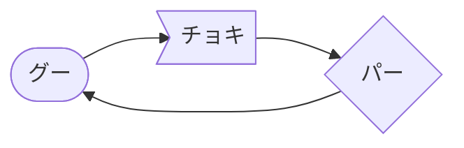

@def title="mermaid.jsのフローチャートメモ"
@def rss_description="mermaid.js　フローチャートの書き方メモ"
@def rss_pubdate=Date(2021, 4, 16)
@def published="16 April 2021"
@def rss_category="blog"
@def hasmermaid=true
@def hascode=true
@def tags=["gadget"]
@def isblog=true

# mermaid.js　フローチャートの書き方メモ

\titleimage{/assets/blog/mermaid.jpg}
\share{blog/mermaid}{mermaid.js フローチャートの書き方メモ}


\toc
## はじめに
フローチャートを書きたいときには、皆どんなツールを使うのでしょうか。

以前の私はパワーポイントで一生懸命作っていましたが、マークダウンエディターで文書を書くようになってからは、[mermaid](https://mermaid-js.github.io/mermaid/#/)[^1]というjavascriptで書かれた描画ツールを使っています。

百聞は一見に如かず。何ができるのか簡単な例をみてみましょう。

\begin{mermaid}
~~~
graph LR
  id1([グー])
  id2>チョキ]
  id3{パー}
  id1-->id2
  id2-->id3
  id3-->id1
~~~
\end{mermaid}
~~~<p style="text-align:center">Fig.1 簡単なフローチャート</p>~~~
[live editor](https://mermaid-js.github.io/mermaid-live-editor/#/edit/eyJjb2RlIjoiZ3JhcGggVERcbiAgICBBW0NocmlzdG1hc10gLS0-fEdldCBtb25leXwgQihHbyBzaG9wcGluZylcbiAgICBCIC0tPiBDe0xldCBtZSB0aGlua31cbiAgICBDIC0tPnxPbmV8IERbTGFwdG9wXVxuICAgIEMgLS0-fFR3b3wgRVtpUGhvbmVdXG4gICAgQyAtLT58VGhyZWV8IEZbZmE6ZmEtY2FyIENhcl0iLCJtZXJtYWlkIjp7fSwidXBkYXRlRWRpdG9yIjpmYWxzZX0)もしくは、typoraやVSCODEなどのマークダウンプレビューが可能なエディターに以下のコードを書くと、Fig.1のようなグラフを得ることができます。

`````markdown

`````


私の考えるmermaidを使うメリットは以下のとおりです。

- ユーザーは図の論理構造だけを考えれば良い。（**ここ重要**）
- フローチャート以外の図も充実している。（ガントチャートやUML図など）
- テキスト形式なのでgitで変更差分を管理できる。
- デフォルトデザインでも結構きれい。
- cssやjavascriptの知識があれば、デザインをカスタマイズ可能。[^2]

[^1]: 2019年に[オープンソース賞](https://osawards.com/javascript/2019)を受賞したとのこと。
[^2]: 本サイトでは、javascriptをいじって色を変えています。

### チートシート
\begin{mermaid}
~~~
graph TD
  id1(["([はじめ])"])
  id2("(家帰る)")
  id3{"{運動したか？}"}
  id4("(風呂に入る)")
  id5[["[[筋トレ]]"]]
  id6(("((ごはん食べる))"))
  id7(["([寝る])"])
  sub1[["[[筋トレ]]"]]
  sub2[/"[/20回やる\]"\]
  sub3[腕立て伏せ]
  sub4[\"[\20回やる/]"/]
  sub5[/"[/アプリで入力する/]"/]
  sub6[("[(データベースに保存する)]")]
  id1-->id2
  id2-->id3
  id3-->|yes|id4
  id3-->|no|id5
  id5-->id3
  id4-->id6
  id6-->id7
  subgraph 腕立て伏せ20回3セットやる
  sub1---sub2
  sub2-.->sub3
  sub3-.->sub4
  sub4-->sub5
  sub4==>|3セット|sub2
  sub5-->sub6
  end
~~~
\end{mermaid}

```
graph TD
  id1(["([はじめ])"])
  id2("(家帰る)")
  id3{"{運動したか？}"}
  id4("(風呂に入る)")
  id5[["[[筋トレ]]"]]
  id6(("((ごはん食べる))"))
  id7(["([寝る])"])
  sub1[["[[筋トレ]]"]]
  sub2[/"[/腕立て伏せ\]"\]
  sub3[腕立て伏せ２０回]
  sub4[\"[\腕立て伏せ/]"/]
  sub5[/"[/アプリで入力する/]"/]
  sub6[("[(データベースに保存する)]")]
  id1-->id2
  id2-->id3
  id3-->|yes|id4
  id3-->|no|id5
  id5-->id3
  id4-->id6
  id6-->id7
  subgraph 腕立て伏せ20回3セットやる
  sub1---sub2
  sub2-.->sub3
  sub3-.->sub4
  sub4-->sub5
  sub4==>|3セット|sub2
  sub5-->sub6
  end
```

\right{めでたしめでたし}
\share{blog/mermaid}{mermaid.jsのフローチャートメモ}
\prev{/blog/hhkb}{HHKBの話}
\backtotop

{{ addcomments }}